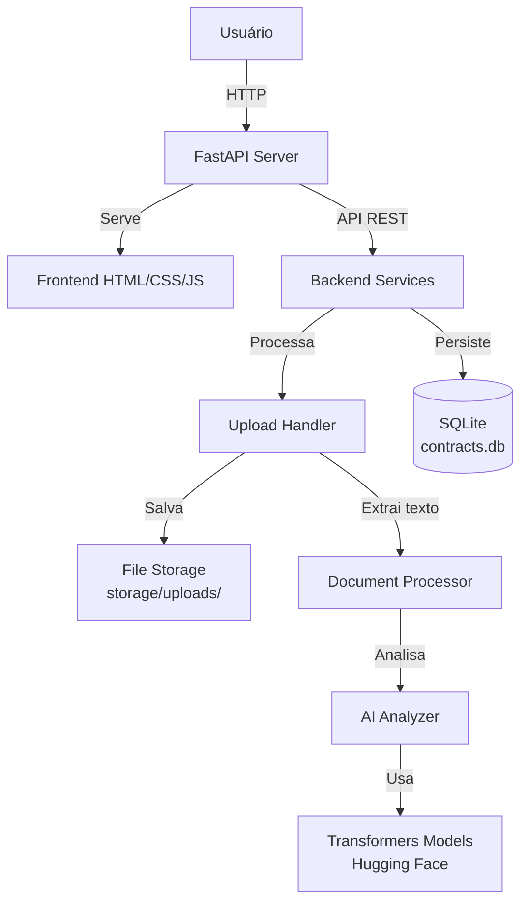
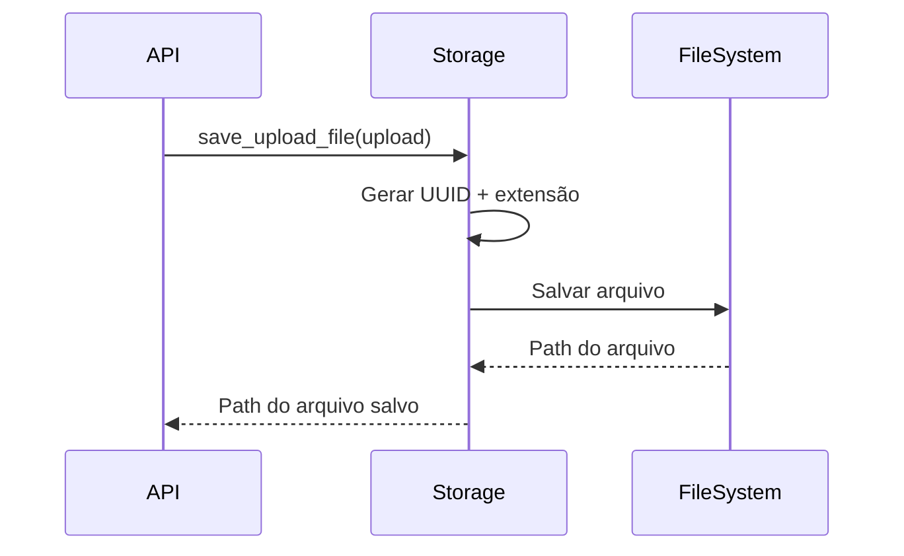
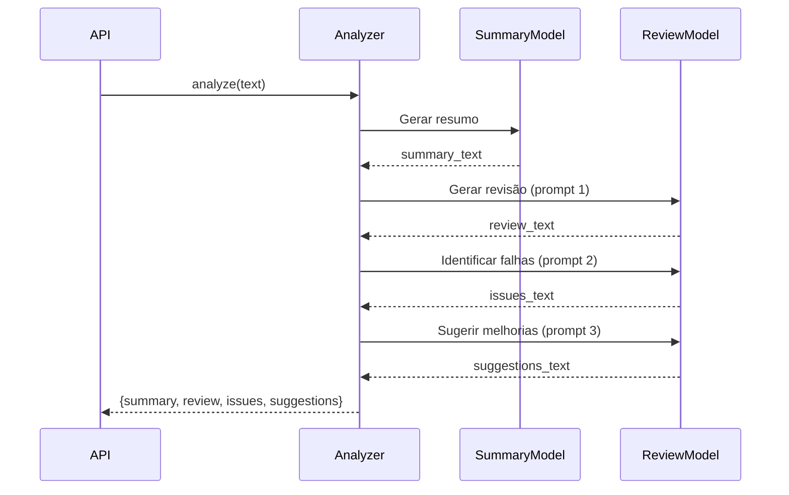
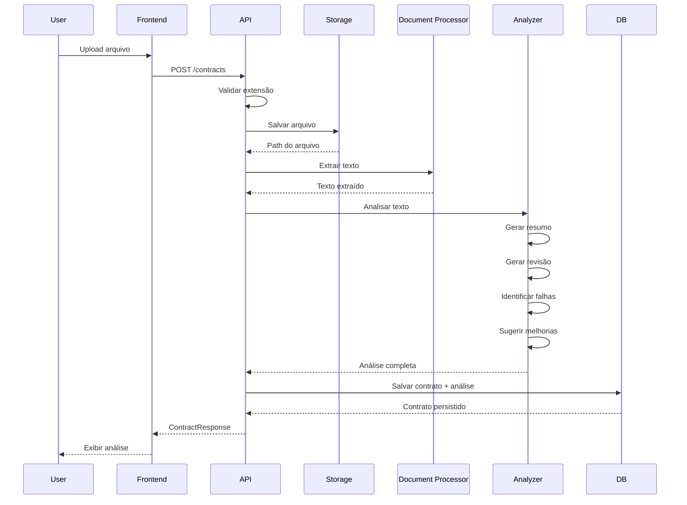

# Arquitetura - HealDeal Contract Analyzer

## Visão Geral da Arquitetura

O HealDeal Contract Analyzer é um MVP de aplicação web monolítica onde o backend FastAPI serve tanto a API REST quanto os arquivos estáticos do frontend, permitindo deploy simplificado em um único endpoint online.



## Camadas da Aplicação

### 1. Frontend (Interface Web)

**Tecnologia**: HTML5 + CSS3 + JavaScript Vanilla ES6+

**Componentes**:
- `index.html` - Estrutura da página
- `styles.css` - Estilos responsivos com design moderno
- `app.js` - Lógica de interação com API

**Responsabilidades**:
- Upload de arquivos de contrato
- Listagem de contratos processados
- Visualização de análises detalhadas
- Download de arquivos originais

**Características**:
- SPA (Single Page Application) sem framework
- Responsivo (mobile-first)
- API base configurável via `window.API_BASE_URL`

### 2. API REST (FastAPI)

**Arquivo**: `backend/app/main.py`

**Endpoints**:

| Método | Rota | Descrição |
|--------|------|-----------|
| GET | `/` | Serve o frontend (index.html) |
| GET | `/static/*` | Serve arquivos estáticos (CSS, JS) |
| POST | `/contracts` | Upload e análise de contrato |
| GET | `/contracts` | Lista todos os contratos |
| GET | `/contracts/{id}` | Detalhes de um contrato |
| GET | `/contracts/{id}/download` | Download do arquivo original |

**Middleware**:
- CORS habilitado (`allow_origins=["*"]`)
- StaticFiles para servir frontend

### 3. Camada de Serviços

#### 3.1 Storage Service (`services/storage.py`)

**Responsabilidades**:
- Salvar arquivos com nomes únicos (UUID)
- Gerenciar diretório de uploads
- Leitura de arquivos

**Fluxo**:


#### 3.2 Document Processor (`services/document_processor.py`)

**Responsabilidades**:
- Extrair texto de PDF (PyPDF2)
- Extrair texto de DOCX (python-docx)
- Extrair texto de DOC (textract - opcional)
- Gerar preview do texto

**Suporte de Formatos**:
- `.pdf` - PyPDF2 (sempre disponível)
- `.docx` - python-docx (sempre disponível)
- `.doc` - textract (dependência opcional)

**Tratamento de Erros**:
- `UnsupportedFileFormat` para formatos não suportados
- Cleanup de arquivo em caso de falha

#### 3.3 AI Analyzer (`services/analyzer.py`)

**Responsabilidades**:
- Carregar modelos Hugging Face Transformers
- Gerar resumo executivo
- Gerar revisão geral
- Identificar falhas e riscos
- Sugerir melhorias de compliance

**Modelos Utilizados**:
- **Resumo**: `sshleifer/distilbart-cnn-12-6` (summarization)
- **Análise**: `google/flan-t5-small` (text2text-generation)

**Otimizações**:
- `@lru_cache` para singleton (modelos carregados uma vez)
- Pipelines reutilizáveis
- Configuração via Settings

**Fluxo de Análise**:


### 4. Camada de Dados

#### 4.1 Database (`database.py`)

**Tecnologia**: SQLAlchemy + SQLite

**Configuração**:
- Engine com `check_same_thread=False` para SQLite
- SessionLocal com autocommit=False
- Dependency injection para sessões

#### 4.2 Models (`models.py`)

**Modelo Contract**:
```python
Contract:
  - id: Integer (PK)
  - original_filename: String
  - stored_filename: String (unique)
  - content_type: String
  - created_at: DateTime
  - summary: Text (nullable)
  - review: Text (nullable)
  - issues: Text (nullable)
  - suggestions: Text (nullable)
  - text_preview: Text (nullable)
```

#### 4.3 Schemas (`schemas.py`)

**Pydantic Schemas**:
- `ContractBase` - Campos base
- `ContractCreate` - Para criação
- `ContractResponse` - Para resposta (inclui id e created_at)

**Validação**:
- Automática via Pydantic
- `orm_mode=True` para conversão de ORM

### 5. Configuração

**Arquivo**: `config.py`

**Tecnologia**: Pydantic BaseSettings

**Variáveis**:
- `database_url` - URL do banco (default: SQLite local)
- `upload_dir` - Diretório de uploads (default: storage/uploads)
- `summary_model` - Modelo de resumo
- `review_model` - Modelo de revisão
- `max_summary_tokens` - Limite de tokens para resumo
- `max_review_tokens` - Limite de tokens para revisão

**Fonte**: Arquivo `.env` (opcional) ou defaults

## Fluxo de Processamento Completo



## Decisões Arquiteturais

### 1. Por que FastAPI serve o frontend?

**Justificativa**: Simplicidade de deploy em um único endpoint online (Render, Railway, Fly.io). Permite CORS configurado corretamente e mesma origem para API calls.

**Trade-off**: Menos escalabilidade independente, mas adequado para MVP.

**Alternativa**: Frontend pode ser hospedado separadamente definindo `window.API_BASE_URL`.

### 2. Por que SQLite?

**Justificativa**: Simplicidade, zero configuração, adequado para MVP e volumes moderados.

**Trade-off**: Não recomendado para alta concorrência.

**Evolução**: Migrar para PostgreSQL em produção (conexão já abstrata via SQLAlchemy).

### 3. Por que modelos open-source locais?

**Justificativa**: Privacy-first, dados sensíveis não saem do ambiente, sem custos de API externa.

**Trade-off**: Maior uso de recursos computacionais, qualidade inferior a modelos proprietários.

**Evolução**: Adicionar suporte a modelos maiores/melhores (llama.cpp, Ollama).

### 4. Por que JavaScript Vanilla?

**Justificativa**: MVP simples, sem build steps, deploy direto, sem dependências frontend.

**Trade-off**: Menos produtivo para features complexas.

**Evolução**: Migrar para React/Vue se complexidade aumentar.

### 5. Por que armazenamento em disco?

**Justificativa**: Simplicidade, sem dependências externas, adequado para MVP.

**Trade-off**: Não escalável horizontalmente sem NFS/blob storage.

**Evolução**: Migrar para S3/Azure Blob em produção.

## Considerações de Segurança

1. **Validação de Arquivos**: Extensão validada no backend
2. **Nomes Únicos**: UUID previne conflitos e sobrescrita
3. **Escape de HTML**: Frontend escapa conteúdo do usuário
4. **CORS**: Configurado para aceitar todas origens (MVP - restringir em produção)
5. **Tratamento de Erros**: Mensagens de erro não expõem detalhes internos

## Considerações de Performance

1. **Cache de Modelos**: `@lru_cache` evita recarregar modelos
2. **Sessões de Banco**: Gerenciadas via context manager
3. **Índices**: ID indexado automaticamente (PK)
4. **Processamento Assíncrono**: Atualmente síncrono (adequado para MVP)

**Evolução**: Adicionar fila (Celery/RQ) para contratos grandes.

## Deploy

### Requisitos Mínimos
- Python 3.10+
- PyTorch (CPU ou GPU conforme disponibilidade)
- 2GB+ RAM (para modelos)
- 1GB+ disco (modelos + uploads)

### Plataformas Recomendadas
- **Render**: Build + deploy automático
- **Railway**: Deploy simplificado
- **Fly.io**: Global edge deployment
- **VPS tradicional**: Uvicorn + systemd

### Variáveis de Ambiente
Definir no `.env` ou na plataforma:
- `SUMMARY_MODEL` (opcional)
- `REVIEW_MODEL` (opcional)
- `DATABASE_URL` (opcional - usar PostgreSQL)

### Comando de Start
```bash
uvicorn app.main:app --host 0.0.0.0 --port 8000
```

## Próximas Evoluções Sugeridas

1. **Autenticação**: JWT + usuários
2. **Processamento Assíncrono**: Celery para contratos grandes
3. **Versionamento**: Histórico de alterações
4. **Comparação**: Diff entre versões
5. **Modelos Locais Avançados**: llama.cpp, Ollama
6. **Testes**: Cobertura com pytest
7. **CI/CD**: GitHub Actions
8. **Monitoramento**: Sentry, New Relic
9. **Banco Produção**: PostgreSQL
10. **Storage Produção**: S3/Azure Blob